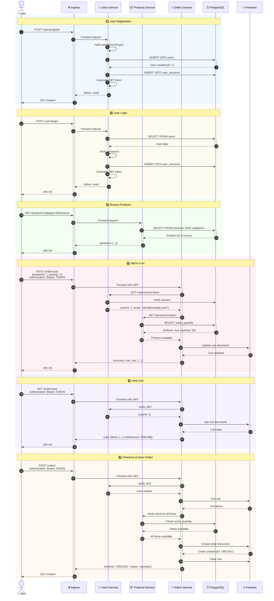
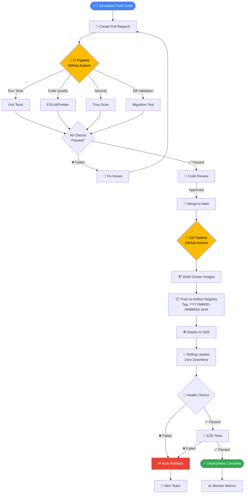
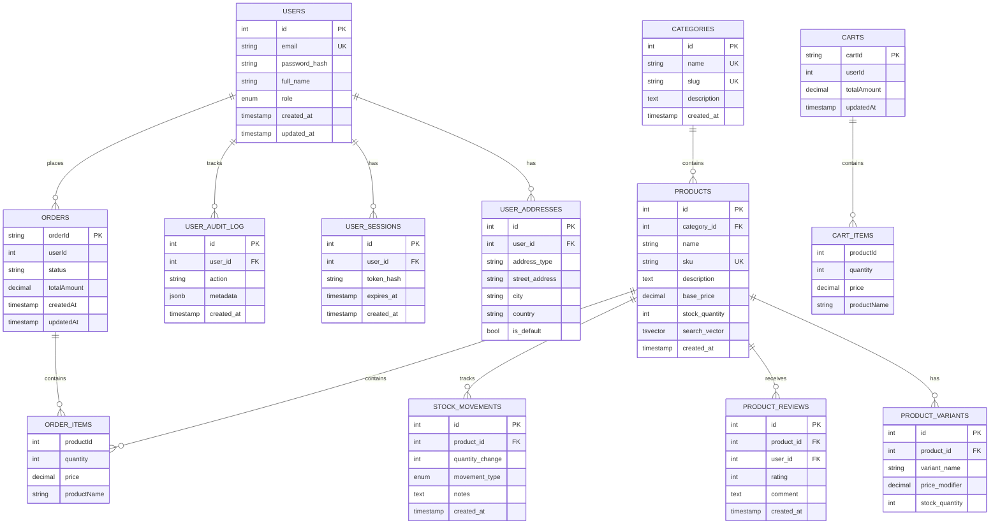
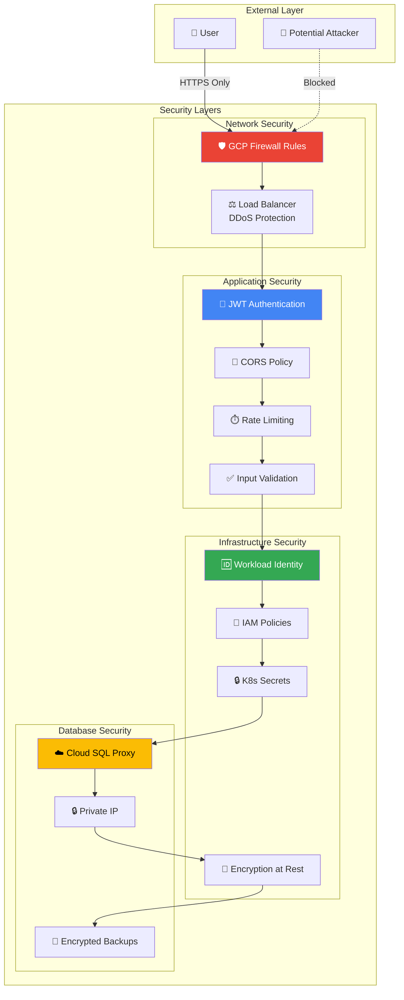
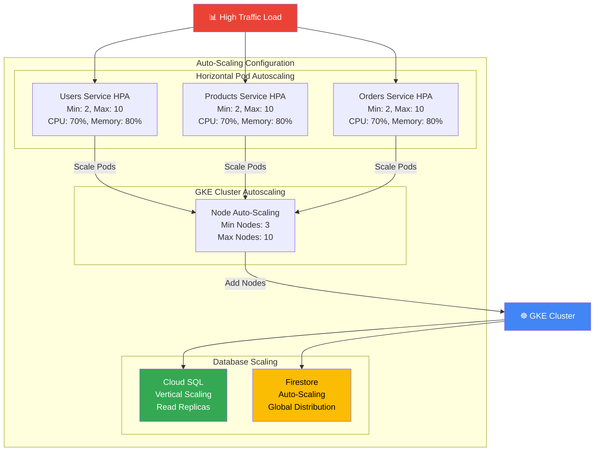
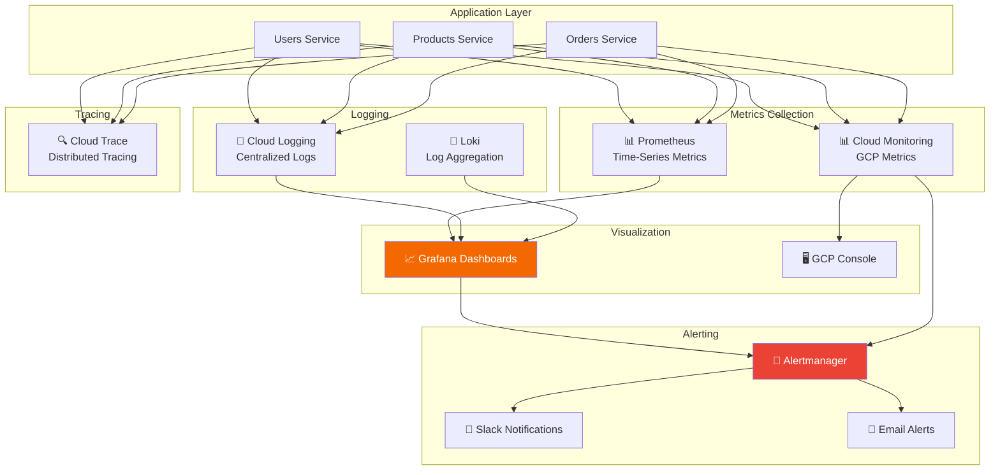
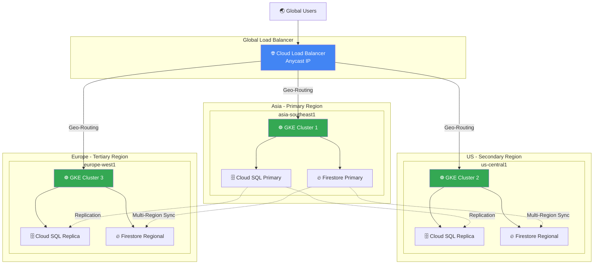

# E-commerce Microservices Architecture Diagram

## 🏗️ Complete System Architecture

```mermaid
graph TB
    subgraph "External Users"
        User[👤 End Users]
        Admin[👨‍💼 Admin]
    end

    subgraph "GitHub CI/CD"
        GHA[🔄 GitHub Actions]
        GHA -->|Build & Test| Docker[🐳 Docker Build]
        Docker -->|Push Images| AR[📦 Artifact Registry]
    end

    subgraph "Google Cloud Platform - asia-southeast1"

        subgraph "GKE Cluster - my-ecommerce-cluster"

            subgraph "Ingress Layer"
                Ingress[🌐 Ingress Controller<br/>nginx/GCP Load Balancer]
            end

            subgraph "ecommerce Namespace"

                subgraph "Users Service - Port 80"
                    US1[👤 users-service Pod 1]
                    US2[👤 users-service Pod 2]
                    USSvc[Service: users-service]
                    US1 --> USSvc
                    US2 --> USSvc
                end

                subgraph "Products Service - Port 80"
                    PS1[📦 products-service Pod 1]
                    PS2[📦 products-service Pod 2]
                    PSSvc[Service: products-service]
                    PS1 --> PSSvc
                    PS2 --> PSSvc
                end

                subgraph "Orders Service - Port 80"
                    OS1[🛒 orders-service Pod 1]
                    OS2[🛒 orders-service Pod 2]
                    OSSvc[Service: orders-service]
                    OS1 --> OSSvc
                    OS2 --> OSSvc
                end

                subgraph "Cloud SQL Proxy Sidecars"
                    Proxy1[☁️ Cloud SQL Proxy<br/>Users Service]
                    Proxy2[☁️ Cloud SQL Proxy<br/>Products Service]
                end

            end
        end

        subgraph "Databases"

            subgraph "Cloud SQL PostgreSQL"
                CSQL[🗄️ ecommerce-postgres<br/>PostgreSQL 15<br/>35.247.191.172]

                subgraph "users_db"
                    T1[users]
                    T2[user_addresses]
                    T3[user_sessions]
                    T4[user_audit_log]
                end

                subgraph "products_db"
                    T5[products]
                    T6[categories]
                    T7[product_variants]
                    T8[product_reviews]
                    T9[stock_movements]
                end
            end

            subgraph "Firestore Native Mode"
                FS[🔥 Firestore<br/>asia-southeast1]

                subgraph "Collections"
                    C1[carts]
                    C2[orders]
                end
            end
        end

        subgraph "IAM & Security"
            SA1[🔐 ecommerce-services-sa<br/>Workload Identity]
            SA2[🔐 github-actions-sa<br/>CI/CD Service Account]
            KSA[☸️ ecommerce-ksa<br/>K8s Service Account]
        end

        subgraph "Container Registry"
            AR2[📦 Artifact Registry<br/>ecommerce-images]
            IMG1[users-service:v2.4-postgres]
            IMG2[products-service:v2-postgres]
            IMG3[orders-service:v2.2-firestore]
        end

        subgraph "Monitoring & Logging"
            CM[📊 Cloud Monitoring]
            CL[📝 Cloud Logging]
        end

    end

    %% External Connections
    User -->|HTTPS| Ingress
    Admin -->|HTTPS| Ingress

    %% Ingress Routing
    Ingress -->|/users/**| USSvc
    Ingress -->|/products/**| PSSvc
    Ingress -->|/orders/**| OSSvc

    %% Service to Service Communication
    OSSvc -->|Verify JWT| USSvc
    OSSvc -->|Check Stock| PSSvc

    %% Database Connections
    US1 --> Proxy1
    US2 --> Proxy1
    Proxy1 -->|Secure Connection| CSQL

    PS1 --> Proxy2
    PS2 --> Proxy2
    Proxy2 -->|Secure Connection| CSQL

    OS1 -->|Firestore SDK| FS
    OS2 -->|Firestore SDK| FS

    %% IAM Connections
    KSA -.->|Bound to| SA1
    US1 -.->|Uses| KSA
    US2 -.->|Uses| KSA
    PS1 -.->|Uses| KSA
    PS2 -.->|Uses| KSA
    OS1 -.->|Uses| KSA
    OS2 -.->|Uses| KSA

    %% CI/CD Flow
    GHA -.->|Uses| SA2
    AR -->|Pull Images| US1
    AR -->|Pull Images| US2
    AR -->|Pull Images| PS1
    AR -->|Pull Images| PS2
    AR -->|Pull Images| OS1
    AR -->|Pull Images| OS2

    %% Monitoring
    US1 -.->|Logs & Metrics| CM
    US2 -.->|Logs & Metrics| CM
    PS1 -.->|Logs & Metrics| CM
    PS2 -.->|Logs & Metrics| CM
    OS1 -.->|Logs & Metrics| CM
    OS2 -.->|Logs & Metrics| CM
    CM -.-> CL

    %% Styling
    classDef database fill:#4285F4,stroke:#1967D2,stroke-width:2px,color:#fff
    classDef service fill:#34A853,stroke:#137333,stroke-width:2px,color:#fff
    classDef ingress fill:#FBBC04,stroke:#F29900,stroke-width:3px,color:#000
    classDef security fill:#EA4335,stroke:#C5221F,stroke-width:2px,color:#fff
    classDef cicd fill:#9334E6,stroke:#7627BB,stroke-width:2px,color:#fff

    class CSQL,FS database
    class US1,US2,PS1,PS2,OS1,OS2 service
    class Ingress ingress
    class SA1,SA2,KSA security
    class GHA,Docker,AR,AR2 cicd
```

---

## 📊 Data Flow Diagram

---

## 🔄 CI/CD Pipeline Flow

---

## 🗄️ Database Schema Diagram

---

## 🔐 Security Architecture

---

## 📈 Scalability Architecture

---

## 🔍 Monitoring & Observability

---

## 🌍 Multi-Region Architecture (Future)

---

## 📝 Component Summary

| Component             | Technology         | Purpose                           | Status        |
| --------------------- | ------------------ | --------------------------------- | ------------- |
| **API Gateway**       | Ingress Controller | Route external traffic            | ⏳ Pending    |
| **Users Service**     | Node.js + Express  | Authentication & user management  | ✅ Running    |
| **Products Service**  | Node.js + Express  | Product catalog management        | ✅ Running    |
| **Orders Service**    | Node.js + Express  | Order & cart management           | ✅ Running    |
| **Cloud SQL**         | PostgreSQL 15      | Relational data storage           | ✅ Running    |
| **Firestore**         | NoSQL Database     | Document storage for carts/orders | ✅ Running    |
| **GKE**               | Kubernetes         | Container orchestration           | ✅ Running    |
| **Artifact Registry** | Container Registry | Docker image storage              | ✅ Configured |
| **GitHub Actions**    | CI/CD              | Automated deployment pipeline     | ✅ Configured |
| **Cloud SQL Proxy**   | Sidecar Container  | Secure database connection        | ✅ Running    |
| **Workload Identity** | IAM                | Secure service authentication     | ✅ Configured |

---

**Last Updated:** October 11, 2025  
**Architecture Version:** v2.0  
**Status:** Production Ready (Ingress Pending)
